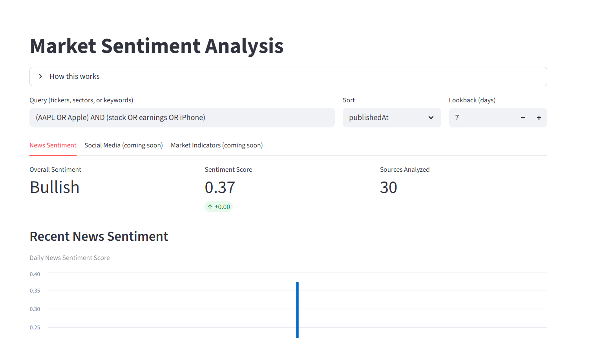
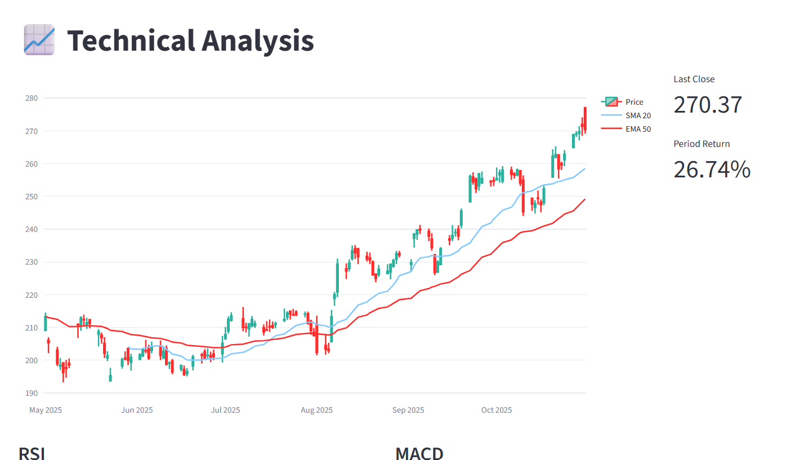

# 🧠 Quant Trading System

> **An end-to-end quantitative trading platform** that combines data pipelines, technical indicators, news sentiment, and Streamlit dashboards — built for research, experimentation, and portfolio analytics.

---


---

## 🚀 Overview

This project demonstrates a modular **quantitative trading system** designed for research-driven traders and data scientists.  
It integrates **market data (via Alpaca & Yahoo Finance)**, **economic indicators (via FRED API)**, and **real-time news sentiment (via NewsAPI)** into an interactive Streamlit dashboard.

The goal is to provide an open-source framework for:
- 💹 Testing trading ideas and indicators  
- 🧩 Analyzing macro and market trends  
- 🗞️ Measuring market sentiment from financial news  
- ⚙️ Automating daily updates and backtests via CI/CD

---

## 🏗️ Project Architecture

```
quant-trading-system/
├── src/qts/
│   ├── config.py              # Centralized configuration (Pydantic v2)
│   ├── data/
│   │   ├── fred.py            # Fetch macroeconomic data from FRED API
│   │   ├── alpaca.py          # Alpaca market data + account info
│   │   ├── news.py            # NewsAPI client + sentiment scoring
│   ├── indicators/            # Technical indicators (RSI, MACD, EMA)
│   ├── utils/                 # Helpers, logging, caching
│   └── __init__.py
├── streamlit/
│   ├── Home.py                # Main dashboard
│   ├── pages/
│   │   ├── 01_Data_Explorer.py
│   │   ├── 02_Technical_Indicators.py
│   │   ├── 03_FRED_Data.py
│   │   ├── 07_Sentiment_Analysis.py   # Live news sentiment visualization
│   └── assets/                # CSS, icons, and themes
├── tests/
│   ├── test_config_min.py
│   ├── test_news_pipeline.py
│   └── ...
├── .github/workflows/
│   └── ci.yml                 # CI/CD workflow (pytest + lint)
├── .env.example
├── pyproject.toml
├── requirements.txt
└── README.md
```

---

## ⚙️ Features

### 📊 Market Data & Indicators
- Pulls OHLC data from **Alpaca** or **Yahoo Finance (yfinance)**.
- Computes custom indicators like **RSI**, **MACD**, **EMA**, and **Bollinger Bands**.
- Displays price action and indicator overlays on Streamlit.

### 🏦 Macroeconomic Insights (FRED API)
- Fetches economic series such as GDP, inflation, interest rates, and unemployment.
- Interactive visualizations for historical and cross-series analysis.

### 🗞️ News Sentiment Analysis (New!)
- Integrates **[NewsAPI](https://newsapi.org/)** for real-time financial headlines.
- Applies **VADER Sentiment Analysis** to classify market tone (Bullish / Bearish / Neutral).
- Aggregates daily sentiment and visualizes score trends.
- Handles rate limits, API retries, and key validation gracefully.

### 🧠 Streamlit Dashboard
- Multi-page architecture for modular workflows.
- Real-time metrics, charts, and data tables.
- Responsive design with custom CSS.

### 🧪 CI/CD Pipeline
- **GitHub Actions** workflow runs tests and linting on every push.
- Optional daily job can refresh cached datasets automatically.

---

## 🔑 Configuration

All credentials and environment variables are handled via `.env` (never commit this file).

Create a `.env` file in your project root:

```bash
FRED_API_KEY=your_fred_key_here
NEWS_API_KEY=your_newsapi_key_here
ALPACA_API_KEY=your_alpaca_key_here
ALPACA_API_SECRET_KEY=your_alpaca_secret_here
ALPACA_PAPER=True
```

> 🧩 All environment variables are loaded automatically via `pydantic-settings`.

You can inspect your configuration safely:
```bash
python -c "from qts.config import settings; print(settings.model_dump())"
```

---

## 🧰 Installation

```bash
git clone https://github.com/sohansputhran/quant-trading-system.git
cd quant-trading-system

# (Optional) create a virtual environment
python -m venv .venv
source .venv/bin/activate   # or .venv\Scripts\activate on Windows

# Install in editable mode
pip install -e .

# Run tests
pytest -q
```

---

## 🧠 Run the Dashboard

```bash
streamlit run streamlit/Home.py
```

The Streamlit sidebar provides navigation to:
- **Market Data Explorer**
- **Technical Indicators**
- **FRED Data**
- **Sentiment Analysis (NewsAPI)**

---

## 🧩 Dashboard Screenshots




---

## 🪶 Logging & Error Handling

- Retries handled via **Tenacity** with exponential backoff.  
- Transient errors (timeouts, rate limits) are retried automatically.  
- Invalid keys or plan limits show clear, human-readable messages in Streamlit.  
- Logs are color-coded by module (`news`, `fred`, `alpaca`, `indicators`).

---

## 🧱 Development Notes

- Python `3.11+`  
- Pydantic v2 + `pydantic-settings`  
- Tested on Windows 11 (RTX 2060 GPU)  
- Dependencies pinned in `pyproject.toml`

---

## 🧩 Future Work

- Integrate **social sentiment** (Reddit, X/Twitter).  
- Add **strategy backtesting** with risk metrics (Sharpe, Sortino).  
- Support **real-time WebSocket data** from Alpaca.  
- Implement **Docker image** + `docker-compose.yml` for deployment.  
- Expand **CI/CD** to run daily market data ingestion.

---

## 🧑‍💻 Author

**Sohan Puthran**  
Data Scientist & AI Engineer  
[LinkedIn](https://www.linkedin.com/in/sohansputhran/) • [GitHub](https://github.com/sohansputhran)

> *This project is part of my AI/ML portfolio, showcasing MLOps, data pipelines, and quantitative trading research.*

---

## 📜 License

MIT License © 2025 [Sohan Puthran](https://github.com/sohansputhran)
